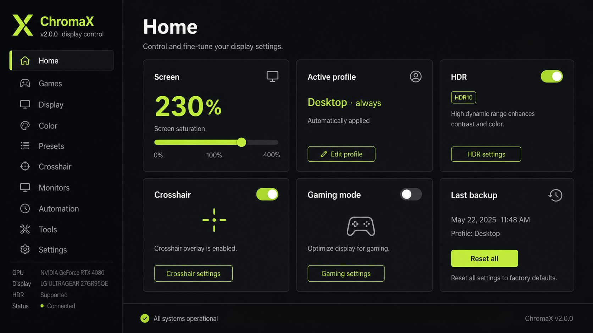
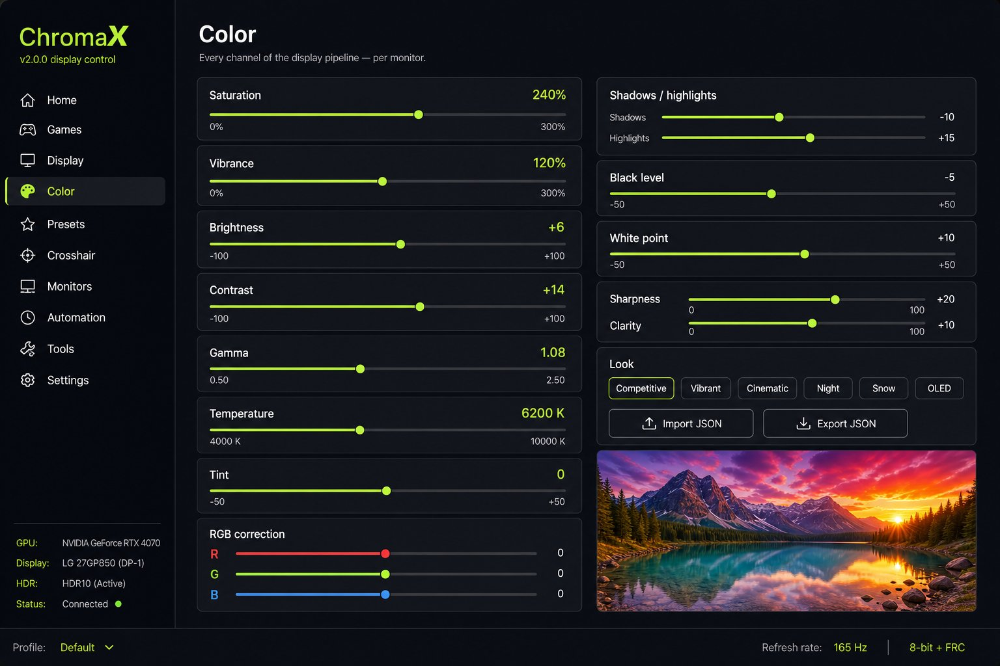
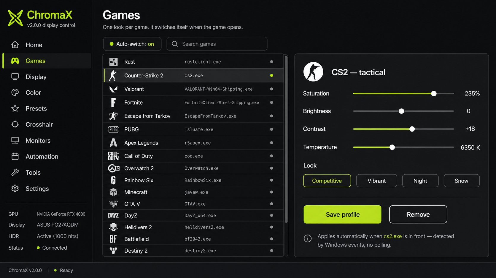

# ChromaX

**Three times the colour. Every game. €0.**

ChromaX is a free, open, portable monitor-colour engine for Windows 10/11. It pushes
saturation to **300%** and exposes the rest of the display pipeline — vibrance,
brightness, contrast, gamma, temperature, tint, RGB, shadows & highlights, black and
white point, sharpness, clarity — on top of per-game looks that switch themselves, an
HDR toggle where Windows has one, a crosshair overlay, resolution & refresh control
and LAN phone control. One ~400 KB exe. No account, no card, no premium tier, no
telemetry.

> It changes what your **monitor** shows. It never touches the game: no memory reads,
> no file edits, no DLL injection, no driver, no admin rights.

| Home | Color |
|---|---|
|  |  |

| Games |
|---|
|  |

*(UI illustrations — the app draws every pixel of this interface itself: no web view,
no bundled image assets at runtime.)*

## Repository layout

| Path | What it is |
|---|---|
| `app/` | The Windows app — plain C11, Win32, hand-drawn dark UI. |
| `app/tests/` | Native unit tests for the platform-independent core (424 checks). |
| `app/Makefile` | Cross-compiles the exe with `zig cc` (`x86_64-windows-gnu`). |
| `site/` | The marketing site (static HTML/CSS/JS) + the downloadable exe. |
| `dist/` | Build output (git-ignored). |
| `LICENSE` | Apache-2.0. |

## Features

**Colour engine** — every control is real, per-monitor, and applied through the
Windows colour layer (`MagnificationSetDeviceColorMatrix`) and/or GPU gamma ramps
(`SetDeviceGammaRamp`):

- Saturation 0–300 % (100 % = untouched; the range is an application control range,
  not a claim of 3× physical colour)
- Vibrance 0–300 %, brightness, contrast
- Gamma 0.5–2.5, temperature 3000–10000 K, tint, per-channel RGB correction
- Shadows & highlights, black level, white point, sharpness, clarity

**Looks & presets** — 18 built-in looks (Competitive, Vibrant, Cinematic, Night,
Snow, OLED, …), procedural preview scenes, and JSON presets you can import and export
(import validates the payload before applying anything).

**Games** — 20+ profiles with tuned starting points (Rust, CS2, Valorant, Fortnite,
Tarkov, PUBG, Apex, COD, Overwatch 2, Rainbow Six, Minecraft, GTA V, The Finals,
DayZ, Helldivers 2, Battlefield, Destiny 2, …). Foreground detection is
**event-driven** (a Windows event hook fires when the front window changes) — no
polling timer, no re-apply loop — and the game itself is never opened, read or
touched.

**Display** — per-monitor resolution/refresh manager. Only modes the driver actually
reports are listed; every change goes through `ChangeDisplaySettingsExW`, so
Windows' own "Keep these changes?" countdown and automatic rollback are your safety
net. Stretched 4:3 and ultrawide presets included.

**HDR** — the real Windows HDR switch (`DisplayConfigSetDeviceInfo`) is shown as a
toggle **only where the driver exposes it**, next to the SDR white level
(`GET_SDR_WHITE_LEVEL`). Where it isn't supported, the app says *not supported*
instead of showing a dead slider. No faked HDR state, ever.

**Crosshair** — nine shapes (cross, dot, circle, square, plus, chevron, T, T-type,
four-dot), size/gap/thickness/rotation, colours and outline, per-monitor placement,
saved library. Rendered on a click-through layered window with 4× supersampling.

**Monitors** — every control targets the monitor you pick (or all of them). Displays
are identified by hardware identity (EDID/monitor ID, resolved at runtime), not by
slot order, so rearranging the desk doesn't swap your looks around.

**Phone control** — a LAN-only HTTP control panel on port 8777, active only while the
toggle is on, guarded by a **random pairing token** generated per run (no hardcoded
password). Off means the port is closed.

**Backup & recovery** — one-click backup/restore of the whole setup, a last-known-good
snapshot that restores automatically, and original gamma ramps written to disk before
anything changes, so a crash can never leave the screen altered.

**Hotkeys** — customizable, with conflict detection: crosshair toggle, reset all,
gaming mode, show/hide.

**Diagnostics** — live readout of display state plus test patterns, exportable to a
file.

**Privacy** — no telemetry, no account, no network calls except the opt-in LAN phone
panel. Config is a plain `config.json` in `%APPDATA%\ChromaX`.

## Windows support

- **Windows 10 and 11, x64.** No installer, no admin prompt, no services.
- Physical-monitor/EDID identity resolves four user32 exports at runtime
  (`GetMonitorIDW`, `GetPhysicalMonitorsFromHMONITORW`, `GetPhysicalMonitorInfo`,
  `ClosePhysicalMonitors`), so the binary runs on Windows 7-era import libraries
  too and degrades gracefully where those exports are missing.
- The colour matrix, gamma ramps, mode changes, event hooks and layered window are
  all stable, long-standing Win32 APIs — nothing bleeding-edge is required for the
  core path.

## GPU support

- **NVIDIA, AMD and Intel** — detection reads the adapter description
  (`GetAdaptersInfo` / display-configuration queries) and is shown on the sidebar.
  The saturation/brightness/contrast/temperature path runs on the Windows colour
  layer, which is vendor-neutral.
- **Vendor control panels are untouched.** ChromaX does not read from or write to
  NVIDIA/AMD/Intel settings. If you run both, the Windows colour layer composites on
  top of whatever the vendor panel sets.
- **HDR is a display/driver capability, not a GPU brand promise.** It appears as a
  working toggle only where Windows exposes it for that display.

## Installing

There is nothing to install. Download `ChromaX.exe` from the [site](site/index.html)
or the [releases](https://github.com/diamantmuqici-dotcom/PlexusX/releases) page,
run it. It stores `config.json` in `%APPDATA%\ChromaX`, restores your original
display state on exit, and uninstalls by deleting the file.

### Portable mode

The default layout *is* portable: one exe, config in `%APPDATA%`, nothing else.
Drop it on a USB stick and it behaves the same on another machine (each machine
keeps its own `%APPDATA%` config).

### Verifying the download

```bash
certutil -hashfile ChromaX.exe SHA256     # Windows
sha256sum ChromaX.exe                     # anywhere else
```

The hash is published on the site's download card, in `site/download/SHA256SUMS.txt`,
and in every GitHub release. The exe is not code-signed (that costs money per
certificate and says nothing about behaviour); the Apache-2.0 source is right here so
you can read what every line does.

## Building

Requires Python 3 and the `ziglang` PyPI package (zig bundles the mingw headers and
linker — no Visual Studio needed):

```bash
pip install ziglang
cd app
make            # -> dist/ChromaX-2.0.0-windows-x64/ChromaX.exe
make site       # also copies the exe + SHA256SUMS.txt to site/download/
make test       # native build & run of the core unit tests (424 checks)
```

`make` cross-compiles all 18 sources with `x86_64-windows-gnu` at `-O2 -Wall
-Wextra` (the build is warning-clean). The linker emits a CONSOLE-subsystem PE;
`tools/fixsub.py` flips it to GUI so no console window appears at runtime.

The GitHub Actions workflow (`.github/workflows/build-windows-exe.yml`) runs the core
tests, builds the exe, and publishes a GitHub release with `ChromaX.exe` and
`SHA256SUMS.txt` on every `v*` tag.

## Security

What ChromaX **never** does:

- never reads or writes a game's memory;
- never changes a game's files;
- never injects code into a game — or any other program;
- never installs a driver or a service;
- never requires admin rights (runs as your user);
- never phones home (no licence server, no account, no telemetry);
- never exposes a network port unless you turn the phone panel on — and then only on
  your LAN, with a random token.

Because it only talks to the standard display pipeline, whether any particular
anti-cheat tolerates *any* third-party program of this kind is the game publisher's
call — check the rules of the game you play. We'd rather tell you that straight than
promise something nobody can promise.

## Privacy

- No telemetry, no analytics, no crash reporting.
- No account, no sign-in, no phone-home of any kind.
- Config is a human-readable `config.json` in `%APPDATA%\ChromaX`; delete it and the
  app forgets you.
- The phone panel binds to your machine's LAN address on port 8777 and requires the
  run-random pairing token; the port is closed when the panel is off or the app
  exits.
- Backups live in `%APPDATA%\ChromaX\backups` — they contain display settings, not
  any game data.

## Troubleshooting

- **"Unknown publisher" / SmartScreen** — the exe isn't code-signed. Verify the
  SHA-256 against the published hash, and you can build it yourself from source.
- **HDR toggle missing** — that means Windows or your driver doesn't expose HDR for
  that display. It's an honest "not supported", not a bug. Check Windows Settings →
  Display → HDR as the reference.
- **A colour change didn't take effect** — some GPU control panels (especially
  NVIDIA "Display Settings" colour options and AMD "Color") write the same pipeline
  and can fight each other; set vendor colour options to defaults and keep ChromaX as
  the one source of truth.
- **Mode change reverted itself** — that's Windows doing its job: the mode wasn't
  stable on that display/driver, so the OS rolled it back. Only driver-reported modes
  are offered.
- **Crosshair visible in screenshots of other apps' overlays** — the crosshair is a
  layered topmost window; exclusive-fullscreen games with their own overlay layer
  (e.g. some capture software) may composite differently.
- **Phone can't connect** — confirm same Wi-Fi/network, that the panel is on, and
  that you used the token printed in the panel. Port 8777 must not be blocked by a
  LAN firewall.

## FAQ

- **Is it a cheat?** No. It changes the display pipeline after the game has drawn
  its frame — the same category as night-light filters, GPU control panels and
  monitor OSD settings.
- **Is it really free?** Yes. There is no premium tier in the code, no licence check
  to bypass and no server to call.
- **Does 300% mean 3× the colour?** No. 100 % is untouched; the slider is an
  application control range implemented in the Windows colour layer. Beyond 100 %
  pushes chroma further than the signal was authored with — like a monitor OSD
  "vivid" mode, not a physical property.
- **Why no installer/admin?** Because the APIs it uses (colour matrix, gamma ramps,
  mode changes, event hooks, layered windows) all work per-user, per-session.

## License

Apache-2.0 — see [LICENSE](LICENSE). Game names belong to their publishers; they
appear only as "works with" compatibility labels.

