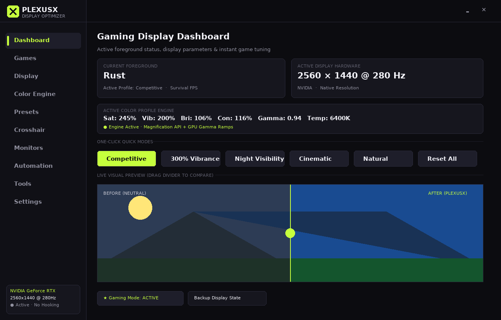
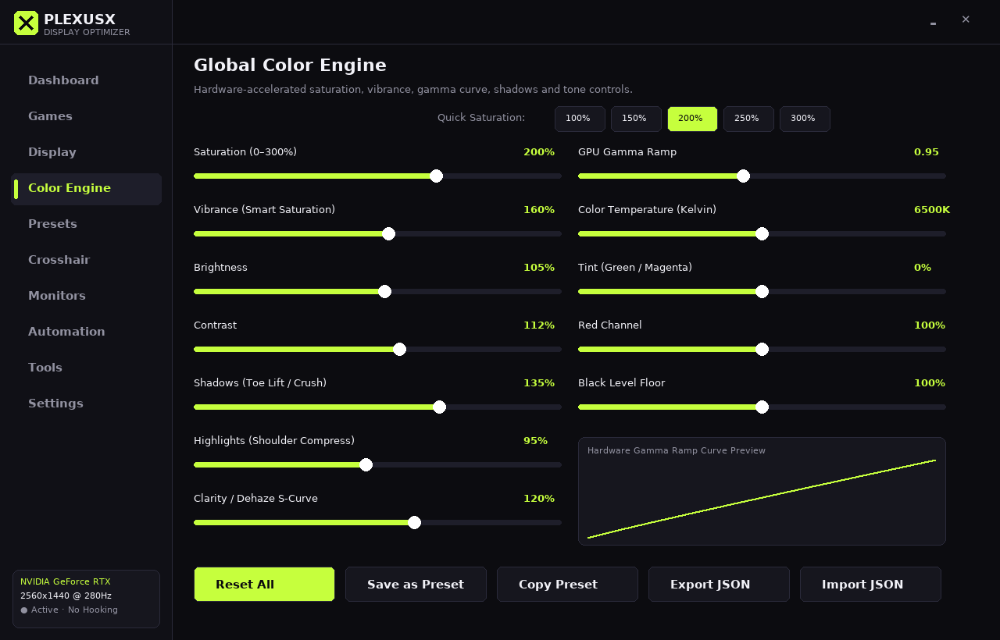
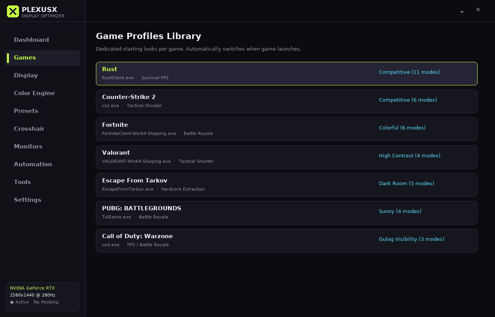
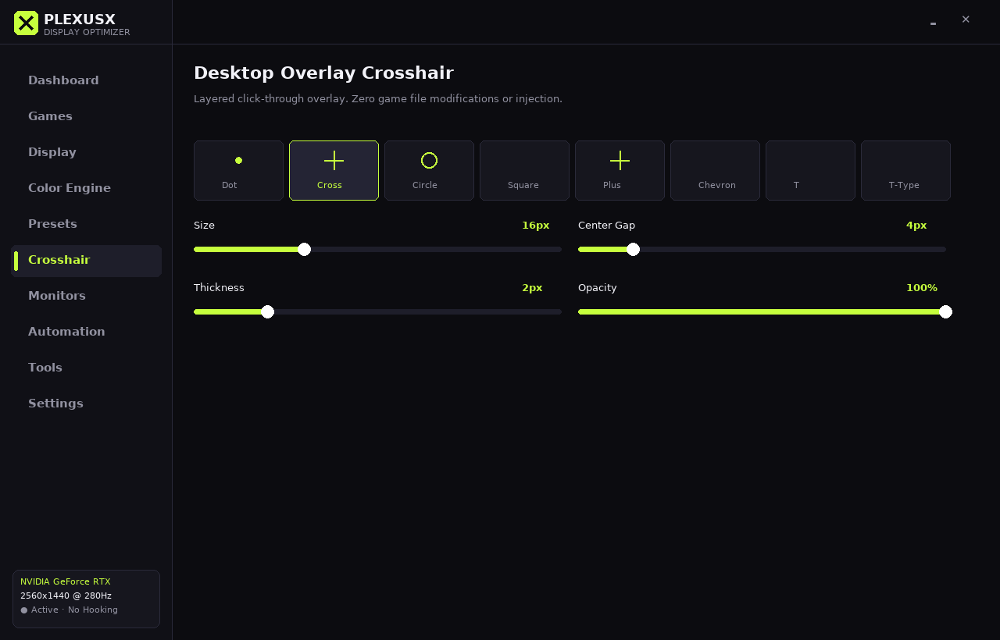

# PlexusX — Windows Gaming Display & Visual Optimization Center

[](https://github.com/diamantmuqici-dotcom/PlexusX/actions/workflows/build-windows-exe.yml)
[](https://opensource.org/licenses/Apache-2.0)
[]()
[]()

> **Your Display. Your Colors. Your Games.**  
> A free, high-performance Windows gaming display and visual control center.  
> Pushes monitor saturation to **300%**, with smart vibrance, 16-bit hardware GPU gamma ramps, 20+ game profiles, an anti-aliased desktop crosshair, stretched 4:3 display modes, secure LAN phone remote control, and full-screen monitor test patterns.

**100% Free · Zero Cheating · Zero DLL Injection · Anti-Cheat Safe**

---

## ⚡ What Makes PlexusX Different

Most gaming monitor tools fall into one of two traps: they are either rudimentary 1-slider utilities, or commercial software bloated with artificial paywalls, accounts, subscription prompts, and background telemetry.

**PlexusX** provides a complete, unified visual suite in a single lightweight Windows executable (347 KB) with near-zero idle CPU footprint:

* **300% Saturation Engine** — Neutral 100% up to 300% application boost, combined with Rec.709-weighted smart vibrance that protects already saturated tones and skin tones.
* **Decoupled Display Pipeline** — Linear controls (saturation, vibrance, hue, temperature, tint, RGB gain, brightness, contrast, black level, white point) run through a 5×5 DWM color matrix, so dragging them never re-programs the GPU. Only the non-linear tone curves (gamma power curve, shadow toe lift, highlight shoulder compression, clarity/dehaze S-curve) are written as monotonic 16-bit lookup tables via `SetDeviceGammaRamp` — and only when a curve actually changes.
* **20+ Per-Game Starting Profiles** — Rust, CS2, Fortnite, Valorant, Escape from Tarkov, PUBG, Apex Legends, Call of Duty / Warzone, Overwatch 2, Rainbow Six Siege, Minecraft, GTA V, DayZ, Helldivers 2, The Finals, and custom game executables.
* **Stretched 4:3 & Refresh Rate Manager** — Instant switching to popular competitive stretched resolutions (`1280x960`, `1440x1080`, `1600x1200`), 16:10, and high-refresh modes (up to 500Hz+) with automatic rollback safety.
* **Desktop Crosshair Overlay** — 4x supersampled layered overlay (`WS_EX_LAYERED | WS_EX_TRANSPARENT`). 8 shapes (Cross, Dot, Circle, Square, Plus, Chevron, T, T-Type), custom colors, and hotkey toggle (`Ctrl+Alt+X`).
* **Multi-Monitor Management** — Target specific monitors independently (`DISPLAY1`, `DISPLAY2`) or synchronize across all displays. Includes a full-screen "Identify Displays" overlay.
* **Event-Driven Foreground Automation** — Automatically detects when a game launches or receives focus, applies the assigned look, and restores your desktop profile upon exiting.
* **LAN Phone Remote Control** — Control display colors and toggle presets from your smartphone on the same Wi-Fi network (`port 8777`). Protected with a random 4-digit pairing PIN.
* **Monitor Test Patterns & Diagnostics** — Built-in test patterns for pure black (OLED/backlight bleed), pure white (uniformity), RGB subpixel inspection, 16-step gradients, and Gamma 2.2 calibration. Every pattern auto-closes after 10 seconds, any key or click exits it, and a high-contrast countdown banner is shown on every monitor.
* **Zero Telemetry & Local Storage** — No analytics, no phone-home, no accounts. All configurations are stored locally in plain INI/JSON.

---

## 📸 Application Screenshots

<div align="center">
  <h3>Home Dashboard with Real-Time Split Preview</h3>
  
  <br><br>
  <h3>Global Color Engine & Hardware Gamma Curve</h3>
  
  <br><br>
  <h3>Game Profiles Library (20+ Pre-Configured Titles)</h3>
  
  <br><br>
  <h3>Anti-Aliased Desktop Crosshair Overlay</h3>
  
</div>

---

## 🛡 Anti-Cheat & Fair Play Architecture

**PlexusX is strictly a display and desktop optimization utility.**

It operates in the exact same legal space as the NVIDIA Control Panel, AMD Software: Adrenalin Edition, Intel Graphics Command Center, or your monitor's physical OSD buttons:

* ❌ **Never** injects DLLs or hooks game processes.
* ❌ **Never** reads, writes, or scans game memory.
* ❌ **Never** modifies game installation files or shaders.
* ❌ **Never** implements aimbots, recoil macros, ESP, or game logic alterations.
* ❌ **Never** requires administrator privileges or kernel drivers.
* ✔ **Legitimate Windows APIs Only**:
  * **Windows Magnification API** (`MagSetFullscreenColorEffect`) for fullscreen color transformation matrices.
  * **GDI Gamma Ramp API** (`SetDeviceGammaRamp`) for direct display lookup table adjustments.
  * **Win32 Layered Windows** (`UpdateLayeredWindow`) for desktop crosshair rendering.
  * **Win32 Window Monitoring** (`GetForegroundWindow` & `QueryFullProcessImageNameW`) for process matching without open memory handles.

---

## 📦 Downloads & Verification

| Deliverable | Description | Size | SHA-256 Checksum |
| :--- | :--- | :---: | :--- |
| **`PlexusX.exe`** | Standalone Portable Executable | 347 KB | `04f6f6cdb82410a9e25d800b31f8b7a8bb743a02c51de02a77540cfd892b04af` |
| **`PlexusX-Setup.exe`** | Setup Installer (with Shortcuts) | 598 KB | `52b082ed72c6f654e263bc583a4d63c023ca014a74b78e3ce826ef26bf040547` |

### Verifying File Integrity

#### Windows PowerShell:
```powershell
Get-FileHash .\PlexusX.exe -Algorithm SHA256
```

#### Windows Command Prompt:
```cmd
certutil -hashfile PlexusX.exe SHA256
```

#### Linux / macOS:
```bash
sha256sum PlexusX.exe
```

---

## 🎮 Game Starting Profiles

PlexusX includes carefully tuned, conservative starting points for popular competitive titles. All parameters can be customized and saved to local presets:

| Game Title | Executable | Starting Presets |
| :--- | :--- | :--- |
| **Rust** | `RustClient.exe` | Competitive, Forest, Night, Snow, Desert, Daylight, Dark Room, Bright, Cinematic, Natural, High Visibility |
| **Counter-Strike 2** | `cs2.exe` | Competitive, Bright, Natural, Cinematic, Low-Light, Default |
| **Fortnite** | `FortniteClient-Win64-Shipping.exe` | Competitive, Colorful, Bright, Natural, Cinematic, Default |
| **Valorant** | `VALORANT-Win64-Shipping.exe` | Competitive, Natural, High Contrast, Default |
| **Escape From Tarkov** | `EscapeFromTarkov.exe` | Dark Room, Outdoor, Natural, High Visibility, Night |
| **PUBG: BATTLEGROUNDS** | `TslGame.exe` | Competitive, Sunny, Natural, High Visibility |
| **Apex Legends** | `r5apex.exe` | Competitive, Vibrant, Natural |
| **Call of Duty / Warzone**| `cod.exe` / `ModernWarfare.exe` | Competitive, Natural, Gulag Visibility |
| **Overwatch 2** | `Overwatch.exe` | Competitive, Vibrant, Natural |
| **Rainbow Six Siege** | `RainbowSix.exe` | Competitive, Dark Angle Boost, Natural |
| **Minecraft** | `javaw.exe` / `Minecraft.exe` | Vibrant, Cave Explorer, Natural |
| **Grand Theft Auto V** | `GTA5.exe` | Natural, Cinematic, Sunset Neon |
| **THE FINALS** | `Discovery.exe` | Vibrant, Competitive |
| **DayZ** | `DayZ_x64.exe` | Forest, Night, Natural |
| **Helldivers 2** | `helldivers2.exe` | Bug Planet Fog, Cinematic, Night Visibility |
| **ARC Raiders** | `ArcRaiders.exe` | Desert Scavenger, Cinematic |
| **Battlefield 2042** | `BF2042.exe` | Ground War, High Visibility |
| **Destiny 2** | `destiny2.exe` | Cosmos Vibrant, Raid Visibility |
| **Custom Games** | Any `.exe` | Add executable manually with custom tags and values |

---

## ⌨ Global Hotkeys

| Hotkey | Action |
| :--- | :--- |
| `Ctrl + Alt + ↑` | Increase Saturation (+10%) |
| `Ctrl + Alt + ↓` | Decrease Saturation (−10%) |
| `Ctrl + Alt + 0` | Reset **all** channels (R/G/B gain, black level, white point) and tone curves (gamma, shadows, highlights, clarity) to neutral |
| `Ctrl + Alt + X` | Toggle Desktop Crosshair Overlay |
| `Ctrl + Alt + E` | Toggle Color Engine On / Off |
| `Ctrl + Alt + G` | Toggle Gaming Mode (ultra-low CPU) |
| `Ctrl + Alt + Shift + R` | **Emergency Safe Reset** — closes every test pattern, bypasses the color engine and restores the display (`Eng_Reset()`) |

---

## 🛟 Safety Nets & Troubleshooting

PlexusX changes global display state, so it ships with several independent ways back to a normal screen:

| If… | Do this |
| :--- | :--- |
| The picture looks wrong, tinted or too dark | Press **`Ctrl + Alt + 0`**. It resets every channel and every tone curve to neutral. |
| Anything is still wrong | Press **`Ctrl + Alt + Shift + R`** (Emergency Safe Reset). It closes all test patterns, **bypasses the color engine** and calls `Eng_Reset()`: identity color matrix plus your original gamma ramps. The same action is in the tray menu and on the **Tools** panel. |
| A full-screen test pattern is showing | It closes by itself after **10 seconds**, and **any key or mouse click** dismisses it immediately. A high-contrast banner (`Display Test Pattern • Click or press ANY key to exit (Xs)`) at the bottom of every monitor shows the countdown. |
| PlexusX crashed | The crash handler restores the display first, then writes a report to `%LocalAppData%\PlexusX\crash.log`. |
| The PC lost power or PlexusX was killed while a curve was active | On the next start the dirty flag triggers a restore of the original gamma ramps saved in `ramps.dat`. The file is validated first (size, device names, monotonic, non-degenerate); a corrupted file is never applied and a clean linear ramp is used instead. |

### How the display pipeline is split

| Stage | API | Controls |
| :--- | :--- | :--- |
| **Linear** | Windows Magnification API — one 5×5 color matrix applied as `[R G B A 1] × M` (translation in row 4, homogeneous W′ column fixed to `[0 0 0 0 1]`, weights sanitized to `[-4, 4]`, NaN/Inf falls back to identity) | saturation, vibrance, hue (Rec.709, white and grays stay put at every angle), temperature, tint, RGB gain, brightness, contrast, black level, white point |
| **Non-linear** | `SetDeviceGammaRamp` — monotonic (non-decreasing) 16-bit ramps; **not called** when gamma = 1.0, shadows = highlights = clarity = 100%, nor when the new ramp equals what is already programmed | gamma, shadows, highlights, clarity |

---

## 📱 LAN Phone Remote Control

Control your monitor's display settings from your smartphone or tablet without leaving full-screen gameplay:

1. In PlexusX, navigate to **Settings** and toggle **LAN Phone Remote Server**.
2. Note the local URL (e.g., `http://192.168.1.100:8777`) and the random 4-digit **Pairing PIN**.
3. Open the URL in your phone's web browser, enter the PIN, and immediately adjust saturation, vibrance, gamma, brightness, and quick presets.
4. **Security Note**: The server binds locally to your private LAN (`0.0.0.0`). It is never accessible from the public internet.

---

## 🛠 Building from Source

PlexusX cross-compiles cleanly on Linux, macOS, or Windows using `zig cc` (which bundles the MinGW runtime and headers):

### Prerequisites
* Python 3.8+
* `ziglang` Python package:
  ```bash
  pip install ziglang
  ```

### Build Commands
```bash
git clone https://github.com/diamantmuqici-dotcom/PlexusX.git
cd PlexusX/app
make clean && make
```

This compiles:
* `site/download/PlexusX.exe` (Main standalone portable GUI executable)
* `site/download/PlexusX-Setup.exe` (Standalone Windows installer)

Both executables are **linked** as GUI programs (`-Wl,--subsystem,windows`), which selects the GUI C-runtime start-up (`WinMainCRTStartup`). Never flip the subsystem byte of a console-linked binary afterwards: the console start-up code would then run inside a GUI-flagged image and abort at launch. `make` ends with `tools/verify_pe.py`, which checks that both files are x64 images with **PE Subsystem 2 (Windows GUI)** and a GUI entry point.

### Running Automated Verification Tests
```bash
# colour math (the real app/src/color_math.h): 5x5 matrix, W' safety, hue, ramps, ramps.dat validation
gcc -std=c11 -Wall -Werror -O2 -o tests/test_runner tests/test_all.c -lm
./tests/test_runner

# engine.c itself against mocked Win32 display APIs (AddressSanitizer + UBSan)
sh tests/host/run.sh
```

---

## 📄 License & Trademarks

* **License**: Apache License, Version 2.0. See [LICENSE](LICENSE) for details.
* **Disclaimer**: All product names, logos, and brands are property of their respective owners. Rust, Counter-Strike 2, Fortnite, Valorant, Escape from Tarkov, PUBG, Apex Legends, Call of Duty, and other mentioned game titles are registered trademarks of their respective publishers and are mentioned solely for compatibility identification. PlexusX is an independent open-source project.
